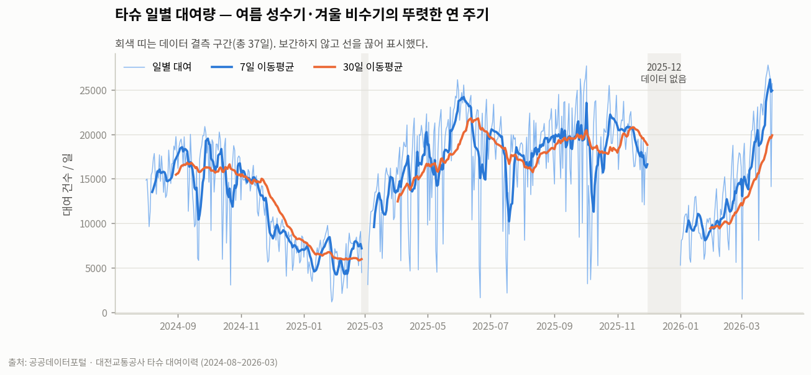
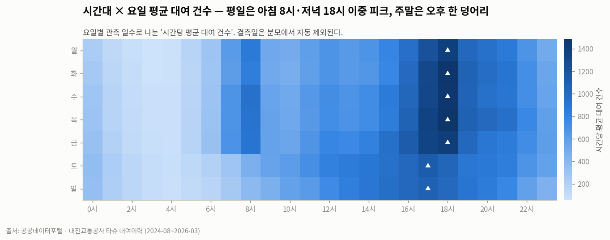
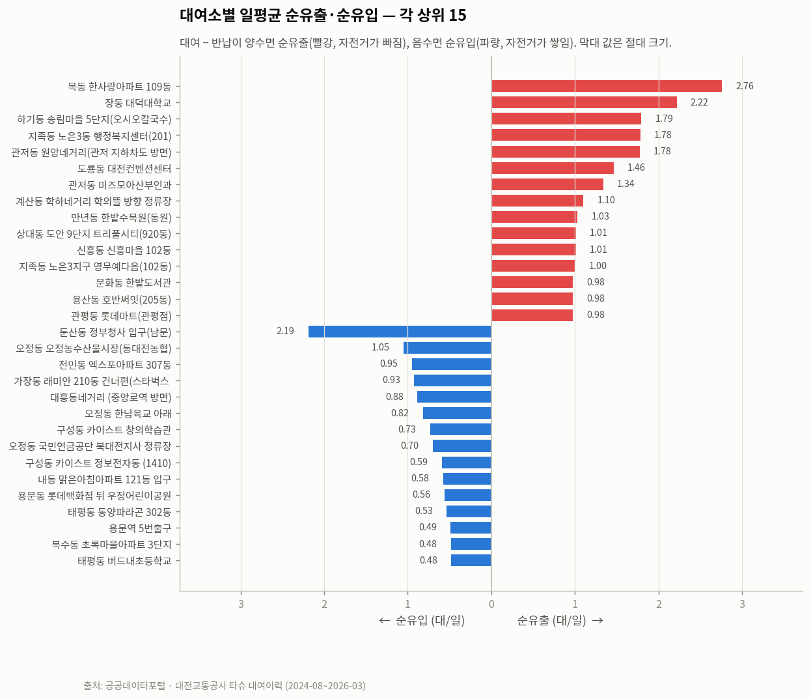
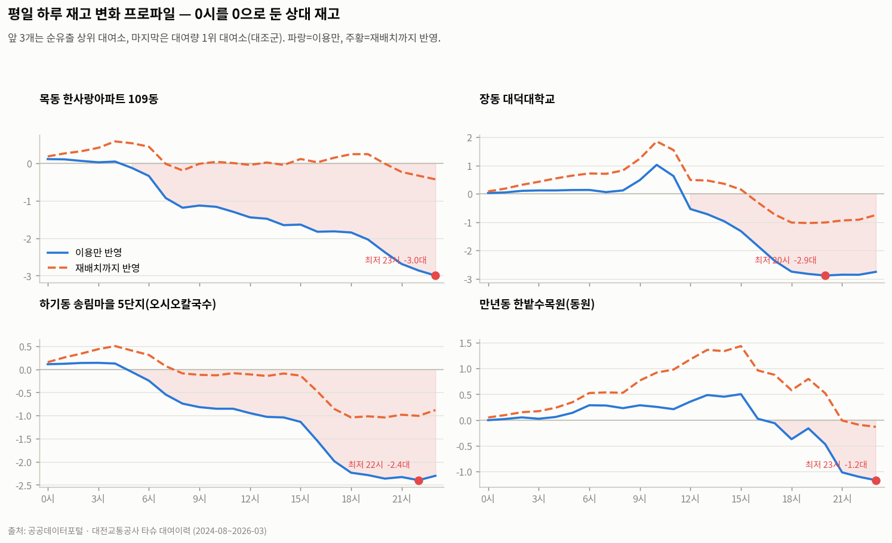
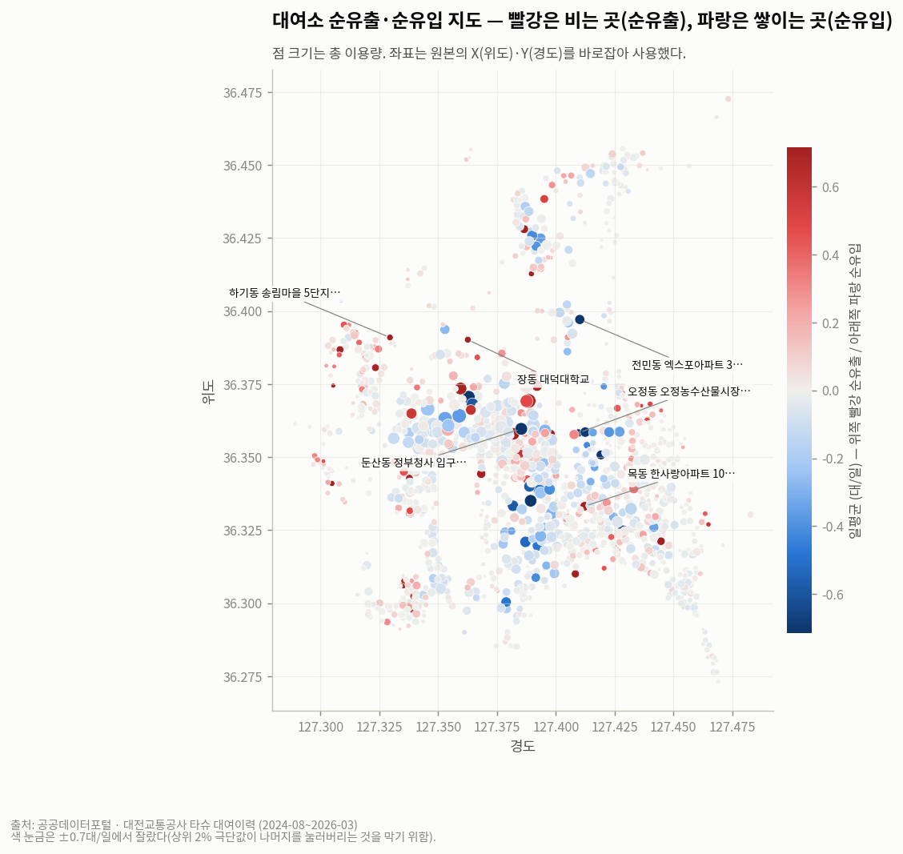
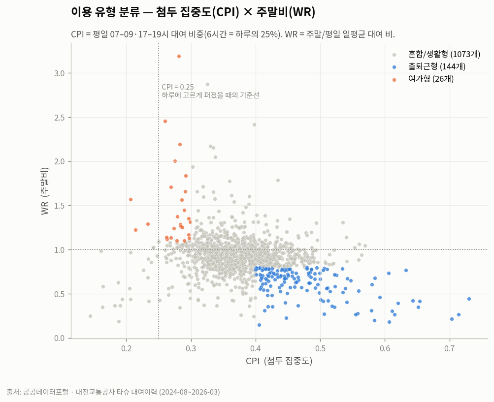
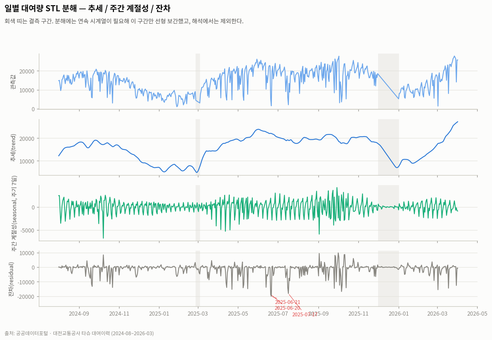
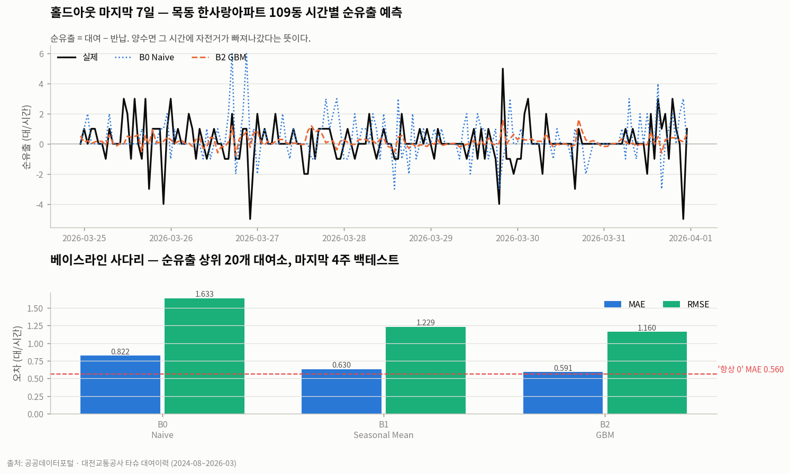
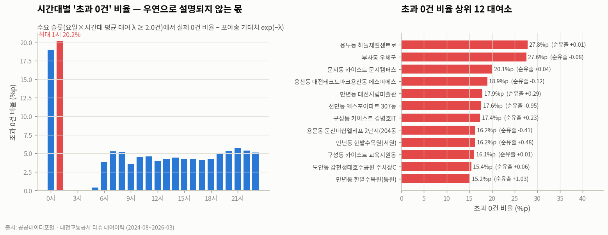
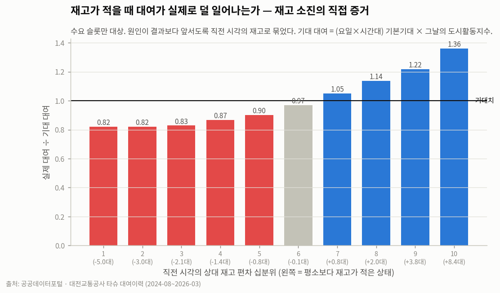

# 대전 공영자전거 타슈 — 어느 대여소가, 언제, 왜 비는가

> 시계열 데이터 분석 리포트 · 대전교통공사 타슈 대여이력 19개월(911만 건)

---

## 1. 분석 주제 및 선정 이유

대전에 산 지 1년 남짓 되는 동안, 집 근처 타슈 대여소에 자전거가 **없어서 못 빌린** 일이
여러 번 있었다. 그런데 시내 다른 대여소는 거치대가 넘칠 만큼 자전거가 쌓여 있었다.

같은 도시, 같은 시스템인데 왜 어떤 대여소는 늘 비고 어떤 대여소는 늘 넘치는가.
이 개인적 경험을 데이터로 확인해보고 싶었다.

**이 분석이 답하려는 것**

1. 어느 대여소가 구조적으로 자전거가 부족한가
2. 부족은 언제, 어떤 패턴으로 발생하는가
3. 왜 그런 일이 생기는가
4. 다음 시간대의 가용 대수를 예측할 수 있는가
5. 무엇을 하면 나아지는가

**한 줄 요약**

> 대여 이력에는 재고(거치 대수) 컬럼이 없다. 그래서 **자전거 한 대 한 대의 이동을 이어 붙여
> 대여소별 재고를 역추적**했고, 그 과정에서 자전거를 옮기는 트럭의 움직임까지 데이터로 복원했다.
> 그 결과 **부족은 이용량이 아니라 방향의 비대칭에서 온다**는 것, 그리고
> **재고가 부족하면 실제로 수요가 억제된다**는 것을 수치로 보였다.

---

## 2. 분석 질문

| # | 질문 | 유형 | 답 |
|---|---|---|---|
| Q1 | 전체 이용량은 어떤 추세와 계절성을 갖는가 | 그래프로 확인 | [인사이트 1](#인사이트-1--이용량은-늘고-있고-계절-진폭이-32배다) |
| Q2 | 하루 중·요일별 이용 패턴은 어떤 모양인가 | 그래프로 확인 | [인사이트 2](#인사이트-2--평일은-이중-피크-주말은-오후-한-덩어리) |
| Q3 | 구조적으로 자전거가 빠져나가기만 하는 대여소는 어디인가 | 추가 해석 필요 | [인사이트 3](#인사이트-3--부족은-총량이-아니라-비대칭의-문제다) |
| Q4 | 부족은 언제, 어떤 패턴으로 발생하는가 | 추가 해석 필요 | [인사이트 5](#인사이트-5--하루-종일-새는-대여소가-있다-그리고-재배치가-그것을-다-못-메운다) |
| Q5 | 다음 시간대의 가용 대수를 예측할 수 있는가 | 보너스(예측) | [8장](#8-예측-실험과-한계) |

---

## 3. 데이터 설명

| 항목 | 내용 |
|---|---|
| 출처 | 공공데이터포털 · 대전교통공사 「대전시 공영자전거 타슈 대여이력 정보」 |
| URL | https://www.data.go.kr/data/15137219/fileData.do |
| 보조 데이터 | 「대전광역시 공영자전거(타슈) 위치 현황」 (2026-06-24 기준) |
| 배포 기간 | 2024-08 ~ 2026-03 (월별 CSV 20개, 약 2.3GB) |
| **실질 분석 기간** | **2024-08-01 ~ 2026-03-31 중 관측 572일** (결측 37일 제외) |
| 원본 행 수 | 9,320,018 (원본 `wc -l` 합계와 정확히 일치) |
| **분석 행 수** | **9,116,471** (중복 배포분 203,547행 제거 후) |
| 대여소 | 1,425개 (분석 본체 ACTIVE 1,332개) |
| 자전거 | 6,776대 (19개월 누적 등장 기준) |
| 컬럼 | 자전거번호, 대여/반납 일시·대여소ID·대여소명·좌표·구·동·주소, 이용시간(분), 이용거리(km) |

### 3-1. 데이터에 **없는** 것 — 이 분석의 출발점

원본에는 **재고(현재 거치 대수)도, 거치대 총 수도 없다.**
"자전거가 부족하다"를 직접 관측할 방법이 없다는 뜻이다.
이 결핍이 이 분석의 방법론 전체를 결정했다(→ [5장](#5-분석-방법)).

### 3-2. 원본 데이터에서 발견한 문제 6가지

전부 직접 확인한 것이며, 근거는 `reports/01_ingest_findings.md` 에 있다.

| # | 문제 | 확인 방법 | 방치했다면 |
|---|---|---|---|
| 1 | **"25년12월" 파일이 2025년 1월 데이터의 완전 중복** (통행키 일치율 **100.00%**) | 월별 날짜 커버리지 점검 + 두 파일 교차 검증 | 1월 수요가 2배로 잡히고 12월이 있는 것처럼 보임 |
| 2 | **2025년 3월만 날짜에 초가 없음** (`2025-03-04 11:02`) | 포맷 고정 파싱 후 3월 366,879행이 전부 NaT | 에러 없이 **한 달이 조용히 사라짐** |
| 3 | **인코딩이 파일마다 다름** (cp949 8개 / utf-8-sig 12개) | 두 번째 파일에서 `UnicodeDecodeError` | 포털 안내대로 CP949 고정 시 적재 중단 |
| 4 | **파일명 한글이 NFD(자모 분리)** — macOS | 정규식 연월 추출 실패 | 파일 목록 자체를 못 만듦 |
| 5 | **대여소명·주소 표기가 월마다 다름** | 같은 `ST0038`의 이름/주소가 월별로 상이 | 이름으로 집계하면 한 대여소가 여러 개로 쪼개짐 |
| 6 | **`X좌표`가 위도, `Y좌표`가 경도** (통념과 반대) | 값 범위 확인 (36.x vs 127.x) | 지도가 뒤집힘 |

**따라서 실질 분석 기간은 20개월이 아니라 19개월이다.**

### 3-3. 알려진 결측 구간 (총 37일)

| 구간 | 일수 | 사유 |
|---|---|---|
| 2025-02-26 ~ 02-28 | 3일 | 시스템 장애 (파일명에 명시) |
| 2025-03-01 ~ 03-03 | 3일 | 시스템 장애 (파일명에 명시) |
| **2025-12-01 ~ 12-31** | **31일** | **파일 중복 배포로 데이터 자체가 없음 (본 분석에서 발견)** |

모든 그래프에서 이 구간은 보간하지 않고 선을 끊어 표시했다.
월별 비교는 "일평균"으로 정규화해 결측일 수 차이를 흡수했다.

---

## 4. 데이터 정제

### 4-1. 정제 규칙과 실제 적용 건수 (9,320,018행 기준)

| 대상 | 기준 | 건수 | 비율 | 처리 |
|---|---|---|---|---|
| 중복 배포 통행 | 통행키(자전거+대여/반납 일시+대여소) 중복 | 203,547 | 2.18% | **제거** |
| 관제센터 대여 | 대여소명에 '관제' | 269,653 | 2.89% | 가상 노드로 분리 |
| 관제센터 반납 | 대여소명에 '관제' | 288,216 | 3.09% | 가상 노드로 분리 |
| 대여 취소 의심 | 이용시간 ≤1분 **AND** 거리 0km | 331,370 | 3.56% | 플래그 (수요 계산에서 제외) |
| 이용시간 이상치 | > 24시간 | 8 | 0.00% | 플래그 |
| 이용거리 이상치 | > 40km | 154 | 0.00% | 플래그 |
| 시간 역전 | 반납 < 대여 | **0** | 0.00% | — |
| 좌표 결측 | — | **0** | 0.00% | — |

**원칙: 어떤 행도 조용히 지우지 않는다.** 전역 중복만 제거하고 나머지는 전부 플래그 컬럼으로 남겨,
어떤 규칙이 어떤 결론에 영향을 주는지 언제든 되짚을 수 있게 했다.

> NaN은 0건이었다. 하지만 **의미상 이상치는 6.5% 수준**이었고,
> 그보다 큰 문제로 **한 달치 파일이 통째로 다른 달의 복제본**이었다.
> "결측치 없음"으로 끝냈다면 분석 전체가 틀어졌을 것이다.

### 4-2. 대여소 유형 분류

19개월 사이 대여소가 생기고 사라진다. 이를 구분하지 않으면 신설 대여소가 "이용량 급증"으로 오독된다.

```
1) CONTROL    : 대여소명에 '관제'                                    →    2개
2) TEMPORARY  : 이름에 (축제|행사|임시|팝업|이벤트)
                OR (존재기간 < 60일 AND 관측이 데이터 끝 7일 이전 종료) →   18개
3) NEW        : 첫 등장이 데이터 종료 90일 이내                       →    7개
4) CLOSED     : 마지막 등장이 데이터 종료 90일 이전                    →   23개
5) LOW_USE    : 활동일 비율 < 0.5 AND 총 이벤트 < 500 AND 기간 ≥ 60일  →   43개
6) ACTIVE     : 나머지 — 부족 진단 본체                              → 1,332개
```

**초안 규칙은 실패했다.** 처음엔 "존재 기간이 짧으면 임시"로만 잡았더니 69개가 걸렸는데,
`0시축제 임시대여소1`(맞음) 외에 **2026년 3월에 새로 생긴 구암역 대여소(신설)**,
**2024년 8월에 닫힌 사학연금회관(폐쇄)**, **607일간 드물게 쓰인 흑석네거리(저이용)** 가 섞여 있었다.
→ **"짧게 존재함"과 "임시로 존재함"은 다르다.** 관측 구간이 데이터의 *끝*에 붙으면 신설,
*앞*에 붙으면 폐쇄, 길게 퍼졌는데 드물면 저이용이다.

---

## 5. 분석 방법

### 5-1. 핵심 아이디어 — 재고가 없으면 만들어 낸다

**(1) 재고 역추적**

```
대여 이벤트: 대여소 s 에서 −1        반납 이벤트: 대여소 s 로 +1
상대재고(s, t) = Σ(+1/−1) 누적
```

절대 대수는 알 수 없으므로 **상대 재고**(오프셋 미지)다. 이 한계는 9장에 명시했다.

> **표기 규칙** — `순유출 = 대여 − 반납` 하나로 계산하되, 읽는 사람이 부호를 해석하지 않도록
> **양수는 「순유출」, 음수는 「순유입」으로 용어를 바꿔 적는다.**
> 이 리포트와 대시보드에서 `−2.08` 은 **`순유입 2.08대/일`** 로 표기된다.
> 단, 정렬·상관계수 등 계산에는 부호 있는 원래 값을 쓴다.

**(2) 자전거 궤적의 끊긴 지점 = 재배치(트럭)**

자전거 b의 통행을 시간순으로 이었을 때 `이전 반납 대여소 ≠ 다음 대여 대여소` 라면
그 사이에 **사람이 옮긴 것**이다. 대여 이력만으로 트럭의 움직임을 복원하는 유일한 방법이다.

| 유형 | 뜻 | 건수 | 결측구간 제외 후 |
|---|---|---|---|
| `RELOCATION` | 일반 → 일반. **물리적 재배치** | 61,559 | 56,041 |
| `CONTROL_OUT` | 관제 → 일반 | 22,438 | 20,582 |
| `CONTROL_IN` | 일반 → 관제 | 5,538 | 5,065 |
| `CONTROL_INTERNAL` | 관제 → 관제 | 125 | 96 |

**(3) 검열된 수요(censored demand)**

```
관측 대여 = min(실제 수요, 그 시점 재고)
```

자전거가 0대인 대여소는 **대여 0건**으로 기록된다. 그래서 "대여가 적다 = 수요가 없다"로 읽으면
정확히 반대로 해석하게 된다. 내가 집 앞에서 겪은 일이 바로 이 **기록되지 않은 수요**다.
7장 인사이트 4에서 이것을 직접 증명한다.

### 5-2. 적용한 시계열 기법 5가지와 선택 근거

| 기법 | 적용 | 왜 이걸 썼나 |
|---|---|---|
| 이동평균 7일 / 30일 | 일별 총 대여량 | 요일 주기가 7일이므로 창을 **7의 배수**로 잡아야 요일 성분이 상쇄된다 |
| 전년 동월 대비 변화율 | 월별 집계 | 절대량은 계절에 좌우된다. 계절을 통제해야 성장 여부가 보인다 |
| 요일 × 시간대 집계 | 대여소 프로파일 | 부족은 하루 중 몇 시간의 문제다. 일 단위 집계에서는 평균에 묻힌다 |
| 누적합(cumsum) | 상대 재고 | 순유출의 누적이 곧 재고 곡선이다 |
| STL 분해 (주기 7) | 일별 총 대여량 | 추세·주간 계절성·잔차 분리. 잔차 급락일 = 외생 충격 후보 |

**집계 단위의 근거**: 전체 추세는 **일 단위**, 부족 진단은 **시간 단위**로 봤다.
[그림 04]가 그 이유다 — "하루 종일 새는" 모양은 시간 단위에서만 보인다.

### 5-3. 처리 파이프라인

```
원본 CSV 20개 (2.3GB, 인코딩 혼재)
  │ 01_ingest.py    인코딩 자동 판별 · 청크 스트리밍 · 정제 플래그
  ▼ trips_YYYYMM.parquet
  │ 02_build_panel.py  전역 중복 제거 · 궤적 재구성 · station_type
  ▼ trips_dedup.parquet (911만) · station_hourly.parquet (618만) · bike_moves.parquet (89,660)
  │ 03_analyze.py   지표·시각화        04_forecast.py  재고 소진 진단·예측
  ▼ images/01~10.png · station_metrics.csv
```

---

## 6. 결과 및 시각화

### 그림 01 — 일별 대여량과 이동평균



여름 성수기와 겨울 비수기의 연 주기가 뚜렷하다. 회색 띠가 결측 구간(37일)이며 선을 끊어 표시했다.
7일 이동평균으로 요일 성분을 지우면 계절 곡선이 드러난다.

### 그림 02 — 시간대 × 요일 히트맵



평일은 아침 8시와 저녁 18시의 이중 피크, 주말은 오후 한 덩어리. ▲ 는 요일별 최대 시간대다.

### 그림 03 — 대여소별 일평균 순유출 랭킹



빨강은 **순유출**(자전거가 빠져나가는 곳), 파랑은 **순유입**(쌓이는 곳).
1위 목동 한사랑아파트는 **순유출 2.76대/일**, 반대편 둔산동 정부청사 남문은 **순유입 2.19대/일**이다.
막대 값은 절대 크기이고, 방향은 색과 축 좌우로 읽는다.

### 그림 04 — 평일 하루 재고 프로파일



0시를 0으로 둔 상대 재고. 앞 3개는 순유출 상위, 마지막은 대여량 1위(대조군).
파랑은 이용만 반영, 주황은 재배치까지 반영한 곡선이다.

### 그림 05 — 순유출 지도



점 크기는 총 이용량. 빨강이 순유출(비는 곳), 파랑이 순유입(쌓이는 곳)이며 유성구에 빨강이 몰려 있다.

### 그림 06 — 이용 유형 분류 (CPI × WR)



CPI(첨두 집중도)와 WR(주말비)로 대여소를 분류했다. 두 지표는 뚜렷한 음의 관계를 보이며
출퇴근형과 여가형이 한 스펙트럼의 양 끝에 있다.

### 그림 07 — STL 분해



추세 / 주간 계절성 / 잔차. 잔차가 크게 음수인 날은 기상 등 외생 충격 후보다.

### 그림 08 — 예측 백테스트



위: 홀드아웃 마지막 7일의 실제 vs 예측. 아래: 모델별 MAE·RMSE와 '항상 0' 기준선.

### 그림 09 — 재고 소진 의심 지표



포아송 기준선 대비 '초과 0건' 비율. 이 지표의 한계는 인사이트 4에서 다룬다.

### 그림 10 — ★ 재고와 대여의 관계



직전 시각의 재고가 낮을수록 다음 시간의 대여가 기대치보다 적다. **검열된 수요의 직접 증거.**

---

## 7. 인사이트

각 인사이트는 **관찰(Fact) / 해석(Why, 가설) / 행동(Action)** 세 층으로 구분해 서술한다.
관찰은 그래프와 수치에서 직접 읽은 것이고, 해석은 가설이며, 행동은 제안이다.

### 인사이트 1 — 이용량은 늘고 있고, 계절 진폭이 3.2배다

**관찰(Fact)** — 월별 일평균 대여 건수 (결측일을 분모에서 제외해 정규화)

| 월 | 일평균 | 전년 동월 | 증감 |
|---|---|---|---|
| 2025-08 | 18,411 | 15,543 | +18.5% |
| 2025-09 | 19,895 | 16,286 | +22.2% |
| 2025-11 | 18,812 | 12,910 | +45.7% |
| 2026-01 | 9,409 | 6,144 | +53.1% |
| 2026-02 | 12,237 | 6,373 | **+92.0%** |
| 2026-03 | 19,774 | 12,210 | +61.9% |

최저 2025년 1월 6,144건/일 → 최고 2025년 9월 19,895건/일, **3.2배 차이**. (그림 01, 07)

**해석(Why, 가설)** — 겨울 저점의 상승 폭(+53~92%)이 여름(+18~22%)보다 훨씬 크다.
비수기 이용이 빠르게 늘고 있다는 뜻이며, 이용자층이 '날 좋을 때 타는 레저'에서
'상시 이동수단'으로 넓어지는 중일 수 있다.
단, 대여소 신설·자전거 증차 효과와 분리되지 않았으므로 확정할 수 없다.

**행동(Action)** — 겨울 수요가 커지면 **재배치 부담도 겨울에 함께 커진다.**
비수기 운영 인력을 여름 기준으로만 잡으면 안 된다.
다음 실험: 대여소 수·가용 자전거 수를 통제한 뒤에도 증가가 남는지 확인.

---

### 인사이트 2 — 평일은 이중 피크, 주말은 오후 한 덩어리

**관찰(Fact)** — 시간대별 대여 비중 (그림 02)

| 구간 | 평일 | 주말 |
|---|---|---|
| 07–09시 | **13.7%** | 8.6% |
| 17–19시 | **24.8%** | 21.6% |
| 최대 시간대 | 18시 (9.41%) | 16시 (7.32%) |
| 부차 피크 | **8시 (5.87%)** | 없음 |

평일은 07시 4.29% → **08시 5.87%** → 09시 3.56%로 아침에 뚜렷한 봉우리가 있는데,
주말에는 07시 1.93% → 08시 3.04% → 09시 3.65%로 계속 오르기만 해 봉우리가 사라진다.

**해석(Why, 가설)** — 아침 봉우리가 평일에만 나타나고 주말에 소멸하는 것은
**통근·통학 수요의 신호**로 보인다. 다만 저녁 피크가 아침의 1.8배인 것은
퇴근 수요에 저녁 여가·생활 이동이 겹쳐 있기 때문일 수 있다. 데이터에 이용 목적은 없다.

**행동(Action)** — 재배치 시각 설계의 근거다.
**아침 8시 피크를 감당하려면 전날 밤~새벽에 채워 두어야 한다.** 아침에 출동해서는 늦다.

---

### 인사이트 3 — 부족은 총량이 아니라 비대칭의 문제다

**관찰(Fact)** — 대여량과 일평균 순유출의 상관계수 **−0.172** (사실상 무관)

대여량 상위 5개 대여소:

| 대여소 | 대여 | 일평균 (대/일) |
|---|---|---|
| 만년동 한밭수목원 | 63,136 | 순유출 1.03 |
| 어은동 한빛아파트 | 61,878 | 순유입 0.35 |
| 구성동 카이스트 서쪽 쪽문 | 59,948 | 순유입 0.36 |
| 궁동 충남대 학생회관 | 56,495 | 순유입 0.24 |
| 도룡동 무역전시관입구 | 55,220 | **순유출 0.03** |

반면 순유출 1위 **목동 한사랑아파트 109동**은 대여량 11,697건(중위권)인데 **하루 2.76대**가 빠져나간다. (그림 03)

**해석(Why, 가설)** — 사람이 몰리는 곳은 왕복 이용이 많아 대여와 반납이 서로 상쇄된다.
문제는 **한 방향으로만 흐르는 곳**이다. 아파트 단지·대학처럼
아침에 나가서 돌아오지 않는 곳에서 순유출이 쌓인다.

**행동(Action)** — **부족 진단의 대상은 대여량 랭킹이 아니라 순유출 랭킹이어야 한다.**
운영 지표를 '이용량 top N'으로 잡고 있다면 정작 비는 대여소를 놓치고 있을 가능성이 높다.

---

### 인사이트 4 — ★ 재고가 부족하면 실제로 덜 빌려 간다 (검열된 수요의 증거)

**관찰(Fact)** — 직전 시각의 상대 재고 편차 십분위별, 실제 대여 ÷ 기대 대여 (그림 10)

| 십분위 | 직전 재고 편차 | 실제 ÷ 기대 |
|---|---|---|
| 1 (최저) | −5.0대 | **0.821** |
| 3 | −2.1대 | 0.828 |
| 5 | −0.8대 | 0.902 |
| 6 | −0.1대 | 0.970 |
| 8 | +2.0대 | 1.137 |
| 10 (최고) | +8.4대 | **1.360** |

**최저 분위 ÷ 최고 분위 = 0.604.** 십분위를 따라 단조로운 기울기가 나타난다.

기대 대여는 `(요일 × 시간대) 기본기대 × 그날의 도시활동지수`로, 계절·날씨·요일 효과를 보정했다.

**해석(Why, 가설)** — 직전 시각 재고가 평소보다 5대 부족하면 다음 시간의 대여가
기대치의 **82%** 로 떨어진다. 자전거가 없어서 못 빌린 수요가 데이터에
"대여 0건"으로 숨어 있다는 뜻이다. **내가 집 앞 대여소에서 겪은 일이
1,332개 대여소 전체에서 통계적으로 재현되었다.**

완전한 인과 추론은 아니다. ① 수요의 자기상관이 남아 있고,
② 재고가 높은 시간이 재배치 직후일 수 있으며, ③ 상대 재고는 오프셋 미지의 추정값이다.

**행동(Action)** — 재고 여유를 늘리면 **잃어버린 수요를 되찾을 수 있다**는 근거가 된다.
"재배치는 비용"이 아니라 "재배치는 이용 회복"으로 프레임을 바꿀 수 있다.

> **이 인사이트는 세 번 틀린 끝에 얻었다.**
> ① "수요 슬롯인데 대여 0건" 지표는 재고 소진율 중앙값 13.45%를 냈는데,
> λ≈1 슬롯에서 우연히 2시간 연속 0이 나올 이론 확률이 13.53%였다 — **노이즈만 세고 있었다.**
> ② 포아송 기준선과 계절 보정을 넣어도 순유출과의 상관은 +0.03에 그쳤다.
> ③ 재고와 대여를 **같은 시각**으로 묶었더니 최저 재고 구간의 비율이 1.057로 오히려 가장 높았다 —
> 많이 빌려 갔기 때문에 재고가 낮아진 **역인과**였다. **직전 시각**으로 바꾸자 기울기가 뒤집혔다.

---

### 인사이트 5 — 하루 종일 새는 대여소가 있다. 그리고 재배치가 그것을 다 못 메운다

**관찰(Fact)** — 평일 하루 상대 재고 프로파일 (그림 04)

| 대여소 | 최저 시각 | 최저값 | 모양 |
|---|---|---|---|
| 목동 한사랑아파트 109동 | 23시 | **−3.0대** | 06시부터 23시까지 **단조 감소** |
| 장동 대덕대학교 | 20시 | −2.9대 | 10시 +1.0 정점 후 11~17시 급락 |
| 하기동 송림마을 5단지 | 22시 | −2.4대 | 05시부터 감소, 15~18시 2차 급락 |
| 만년동 한밭수목원 *(대조군)* | 23시 | −1.2대 | 15시까지 +0.5 유지, 저녁에만 감소 |

재배치 충족률 (재배치 순유입 ÷ 순유출):

| 대여소 | 순유출 | 재배치 순유입 | 미충족 | 충족률 |
|---|---|---|---|---|
| 목동 한사랑아파트 109동 | 1,580 | 1,160 | 420 | 73.4% |
| 장동 대덕대학교 | 1,269 | 876 | 393 | 69.0% |
| 하기동 송림마을 5단지 | 1,027 | 518 | 509 | **50.4%** |
| 지족동 노은3동 행정복지센터 | 1,021 | 513 | 508 | **50.2%** |

**해석(Why, 가설)** — 목동 한사랑아파트는 **특정 시간에 몰려 비는 게 아니라 아침부터 밤까지 계속 샌다.**
아파트 단지에서 나가는 이동은 있는데 돌아오는 이동이 없다는 뜻이고,
이용자들이 편도로만 쓰고 다른 곳에 반납한다는 가설과 맞는다.
운영사가 이 대여소를 채우고 있는 것은 데이터로 확인되지만(재배치 유입 1,269 vs 유출 58),
순유출의 **절반~4분의 3만** 메우고 있다.

**행동(Action)** — 하루 1회 재배치로는 구조적으로 부족하다.
① 새벽 선제 배치 + ② 오후 2차 보충의 2회 운영, 또는 ③ 거치 대수 자체의 상향이 필요하다.

> **주의**: 재배치 시각은 궤적 공백의 *중간점*으로 추정한 값이라
> 그림 04의 주황 선이 보여주는 "언제 채워지는가"는 신뢰도가 낮다.
> 재배치의 **총량과 방향**은 신뢰할 수 있지만 **시각**은 실측 확인이 필요하다.

---

### 인사이트 6 — 재배치 강도가 낮고, 순유출은 유성구에 집중된다

**관찰(Fact)**

- 물리적 재배치(일반→일반, 결측 구간 제외) **56,041건 ÷ 572일 = 하루 98.0건**
- 19개월간 등장한 자전거 6,776대(동시 운용 약 3,500대) 규모 대비 하루 98대
- 구별 순유출 합계:

| 구 | 대여소 수 | 순유출 합계 |
|---|---|---|
| **유성구** | 357 | **11,652** |
| 서구 | 366 | 2,646 |
| 대덕구 | 175 | 1,223 |
| 동구 | 223 | 1,139 |
| 중구 | 211 | 871 |

유성구는 대여소 수가 서구와 비슷한데 순유출 합계는 **4.4배**다. (그림 05)

**해석(Why, 가설)** — 순유출 총합이 양수라는 것은 그 구에서 나간 자전거가
다른 구에서 반납된다는 뜻이다. 유성구(대학·연구단지·신도시)에서 빠져나가
서구·중구 방향으로 흘러가는 편도 이동이 우세할 수 있다.
지형(고지대→저지대)과 대여소 밀도 차이도 후보 원인이며, 현재 데이터로는 구분되지 않는다.

**행동(Action)** — 구 단위 재배치 물량 배분의 근거가 된다.
다음 분석: 출발지–도착지(OD) 행렬을 구 단위로 집계해 흐름의 방향을 직접 확인.

---

### 빗나간 가설도 결과다 — 이용 유형으로는 부족을 예측할 수 없다

분석 착수 전 세운 가설은 **"출퇴근형 대여소가 아침에 비워진다"** 였다.
이를 검증하려고 두 지표를 정의했다.

```
CPI(첨두 집중도) = 평일 07–09시 + 17–19시 대여 비중   (이 6시간 = 하루의 정확히 25%)
WR(주말비)       = 주말 1일 평균 대여 ÷ 평일 1일 평균 대여
```

분류 결과: 출퇴근형 144 · 여가형 26 · 혼합/생활형 1,073 · 판정 불가 89개.

**그런데 데이터는 가설을 지지하지 않았다.**

- CPI ↔ 일평균 순유출 상관: **−0.06**
- WR ↔ 일평균 순유출 상관: **+0.013**
- 순유출 상위 30개의 유형 구성: 혼합/생활형 **23** · 출퇴근형 6 · 여가형 1

**이유(해석)** — CPI/WR은 *시간 프로파일의 모양*을 재는 지표인데,
부족은 *방향의 비대칭*에서 온다. 하루 종일 조금씩 한 방향으로만 흐르는 대여소는
프로파일이 평탄해 CPI가 낮게 나오지만 실제로는 가장 심하게 빈다.
**이 빗나감이 오히려 인사이트 3을 강화한다.**

**행동** — 유형 분류는 *이용 패턴 설명*에는 쓰되 **부족 예측 변수로는 쓰지 않는다.**

---

## 8. 예측 실험과 한계

**예측 대상**: 순유출 상위 20개 대여소의 **다음 1시간 순유출**
**검증**: 마지막 4주(2026-03-04 ~ 03-31) 홀드아웃, **시간 순서 유지 분할**. 학습 252,000행 / 검증 13,440행

| 모델 | 입력 | MAE | RMSE | B0 대비 MAE |
|---|---|---|---|---|
| **B0** Naive | 168시간 전(지난주 같은 요일·시각) 값 | 0.822 | 1.633 | — |
| **B1** Seasonal Mean | 최근 8주 (요일×시간대) 평균 | 0.630 | 1.229 | −23.3% |
| **B2** GBM | lag(1,2,3,24,168) · rolling(3,24,168) · 순환 인코딩 | **0.591** | **1.160** | **−28.2%** |
| *(참고)* 항상 0 | — | **0.560** | 1.237 | −31.9% |

### ★ 가장 중요한 줄은 마지막 줄이다

**관찰** — "항상 0으로 예측"이 **MAE 0.560으로 모든 모델보다 낫다.**
반면 RMSE는 B2(1.160)가 '항상 0'(1.237)보다 낫다.

**해석** — 시간당 순유출은 평균 0 근처에서 요동치는 값이다.
MAE를 최소화하는 최적 예측은 **조건부 중앙값**인데 대부분의 시간에 그 값이 0이다.
따라서 MAE 기준으로는 아무것도 하지 않는 예측이 이긴다.
B2가 RMSE에서 이긴다는 것은 **큰 변동을 부분적으로 잡아낸다**는 뜻이다.

**행동** — 운영 목적이 "재고가 크게 무너지는 순간을 놓치지 않는 것"이라면
**평가 지표는 MAE가 아니라 RMSE여야 한다.**
"MAE가 28% 좋아졌다"만 보고했다면 잘못된 결론에 도달했을 것이다.

### 예측의 한계 (반드시 함께 읽어야 할 것)

1. **날씨 미반영** — 자전거 수요의 가장 큰 외생 변수. 기상 데이터 결합이 개선 1순위
2. **재배치 스케줄을 모름** — 이건 재고 예측이 아니라 **"개입이 없을 때의 순유출 예측"** 이다
3. **검열된 수요** — 인사이트 4에서 확인했듯 재고가 낮으면 관측 대여가 억제된다.
   학습 데이터의 y 자체가 아래로 잘려 있어 **예측은 구조적으로 과소추정**된다
4. **절대 재고 미지** — "가용 대수"를 직접 예측하려면 오프셋과 거치대 용량 실측이 필요하다

---

## 9. 결론 및 한계점

### 결론

1. **부족은 이용량이 아니라 비대칭의 문제다.** 대여량과 순유출의 상관은 −0.172로 사실상 무관하다.
   운영 지표를 이용량 랭킹으로 잡으면 정작 비는 대여소를 놓친다.
2. **재고 부족은 실제로 수요를 억제한다.** 직전 시각 재고가 평소보다 5대 부족하면
   다음 시간 대여가 기대치의 82%로 떨어진다(최저/최고 십분위 비 0.604).
   즉 관측된 이용량은 실제 수요의 하한이다.
3. **운영사는 옳은 방향으로 재배치하고 있지만 양이 부족하다.**
   순유출 상위 대여소에는 재배치 유입이, 순유입 상위에는 유출이 잡혔다(방향 일치).
   그러나 충족률은 50~73%이고, 도시 전체 물리적 재배치는 하루 98건이다.
4. **가장 시급한 대상은 주거·대학 인근의 편도 유출 대여소**다.
   목동 한사랑아파트(순유출 2.76대/일), 장동 대덕대학교(2.22대/일), 하기동 송림마을(1.80대/일) 등.

### 제안

| 우선순위 | 제안 | 근거 |
|---|---|---|
| 1 | **순유출 랭킹을 운영 KPI로 채택** (이용량 랭킹 대신) | 인사이트 3 |
| 2 | **새벽 선제 배치 + 오후 2차 보충**의 2회 운영 | 인사이트 2·5 |
| 3 | 충족률 50%대 대여소부터 **거치 대수 상향 검토** | 인사이트 5 |
| 4 | 겨울철 운영 인력을 여름 기준으로 축소하지 않기 | 인사이트 1 |

### 한계점

| # | 한계 | 영향 |
|---|---|---|
| 1 | **절대 재고를 모른다** — 상대 재고만 복원 가능 | "몇 대 남았는가"는 답할 수 없다. 순위 비교만 유효 |
| 2 | **거치대 용량 데이터가 없다** | 과잉 대여소의 '넘침' 시점을 특정할 수 없다 |
| 3 | **관제센터 경유 통행 2.4%는 한쪽 끝이 미상** | 대여소별 오염 비율 중앙값 2.34%, 최대 9.24% = 재고 추정 오차 상한 |
| 4 | **재배치 시각은 궤적 공백의 중간점 추정** | 총량·방향은 신뢰, **시각은 신뢰도 낮음** |
| 5 | **날씨·기온 미반영** | 잔차의 상당 부분이 설명되지 않음 |
| 6 | **결측 37일** (2025-02·03 장애, 2025-12 미배포) | 겨울 구간 해석에 주의 필요 |
| 7 | **인과 추론이 아니다** | 인사이트 4는 강한 연관이지만 실험이 아니다 |
| 8 | **재고 소진을 직접 관측 못 함** | '초과 0건' 지표는 과산포에 오염됨. 실측 검증 필요 |

### 다음 단계 — 타슈 OpenAPI 실측 검증

한계 1·2·4·8은 모두 **실시간 데이터 하나로 해소된다.**
`realtime/` 서브패키지를 본 분석과 **완전히 분리해** 미리 구성해 두었다(키 발급 대기 중).

1. 5분 간격 전 대여소 현황 수집 → 2주 축적
2. 검증 ①: 추정 Δ재고 vs 실측 Δ재고의 대여소별 상관
3. 검증 ②: 순유출로 지목한 대여소가 실제로 0대 상태가 잦은가
4. 검증 ③: `racks_total`로 거치대 용량·재고 오프셋 확정 → 추정 재고 절대값 보정
5. 검증 ④: **관제센터에 실제 자전거가 거치돼 있는가** → 관제센터의 정체(장부상 보정 vs 실제 정비 반출입) 판별

---

## 10. AI 사용 로그

이 분석은 Claude(Cowork)와 함께 수행했다. 아래는 **어디에 썼고, 왜 썼고, 어떻게 검증했는지**의 기록이다.

| 사용 작업 | 사용 이유 | 검증 방법 | 결과 |
|---|---|---|---|
| CP949/UTF-8 혼재 대용량 CSV 청크 적재 코드 생성 | 보일러플레이트 시간 절감 | 월별 적재 행 수를 원본 `wc -l` 과 1:1 대조 | 9,320,018행 **정확히 일치** |
| 재배치 탐지 SQL(윈도우 함수) 작성 | 대안 접근 비교 탐색 | **pandas로 독립 재구현**해 자전거 300대·재배치 4,034건 건별 대조 + 자전거 3대 궤적 육안 확인 | **완전 일치** |
| 대여소 유형 분류 규칙 설계 | 기준을 명시적으로 세우기 위해 | 초안 규칙을 실제 데이터에 적용해 상위 사례를 직접 확인 | **69개 중 다수 오분류 발견 → 규칙 수정** |
| 재고 소진 대리지표 설계 | 직접 관측 불가한 대상의 추정 | **포아송 이론값을 손으로 계산해 대조** | 산출 13.45% vs 이론 13.53% → **지표 폐기 후 재설계** |
| 재고–대여 관계 검정 설계 | 검열된 수요 증명 | 최저 재고 구간 비율이 1.057로 나온 것을 이상하게 여겨 인과 방향 재검토 | **역인과 발견 → 직전 시각으로 수정** |
| 예측 모델 구성·백테스트 | 베이스라인 비교 | **'항상 0' 무지성 기준선을 일부러 함께 계산** | **MAE 기준 모든 모델이 패배 → 평가 지표 재선택** |
| 시각화 코드 작성 | 그림 규격 통일 | 렌더링 후 **10개 그림 전부 육안 확인** (한글 폰트·라벨 겹침·주석 잘림·결측 구간 표시) | 4회 수정 |
| 리포트 문장 다듬기 | 가독성 | 모든 수치를 산출 CSV와 재대조 | — |

### 검증 원칙

> **AI가 만든 숫자는 숫자가 아니다.**
> 이 리포트의 모든 수치는 `src/` 의 스크립트 출력에서 나왔고,
> 재현 가능하며(`python3 src/01_ingest.py` → `04_forecast.py`), 최소 한 번은 교차 확인했다.

### 이 분석에서 잡은 함정 (전부 기준선을 세워 대조했기 때문에 잡혔다)

| # | 함정 | 무엇으로 잡았나 |
|---|---|---|
| 1 | "25년12월" 파일이 25년 1월의 복제본 | 월별 날짜 커버리지 점검 |
| 2 | 3월만 초 단위 없어 366,879행이 전부 NaT | 같은 커버리지 점검 |
| 3 | 인코딩 혼재 / 파일명 NFD | 실행 중 에러 |
| 4 | **같은 코드가 매번 다른 답** (재배치 89,915→89,981→89,958) | 연속 실행 결과 대조 → 정렬 tie-breaker 누락 |
| 5 | 결측일이 대여 0건으로 위장해 평균을 6% 낮춤 | 일별 커버리지 재확인 |
| 6 | 재고 소진 지표가 포아송 노이즈만 셈 | 이론 확률 손계산 |
| 7 | 대여소 개설 이전 기간의 0건까지 집계 | 상위 목록을 신설 대여소가 독식 |
| 8 | 재고–대여 검정의 인과 방향이 반대 | 결과의 부호가 상식과 반대 |
| 9 | MAE만 보면 "아무것도 안 하는 예측"이 최고 | '항상 0' 기준선 |

---

## 부록. 재현 방법

```bash
python3 -m venv .venv && source .venv/bin/activate
pip install -r requirements.txt

python3 src/01_ingest.py        # 원본 CSV → 정제 parquet + 대여소 마스터  (약 80초)
python3 src/02_build_panel.py   # 중복 제거 · 재배치 탐지 · 시간 패널      (약 23초)
python3 src/verify_02.py        # 재배치 로직 교차 검증
python3 src/03_analyze.py       # 지표 · 그림 01~07
python3 src/04_forecast.py      # 재고 소진 진단 · 예측 · 그림 08~10
```

원본 데이터는 용량(2.3GB) 때문에 저장소에 포함하지 않는다.
[공공데이터포털](https://www.data.go.kr/data/15137219/fileData.do)에서 내려받아
`data/대전교통공사_대전시 공영자전거 타슈 대여이력 정보_20260331/` 에 둔다.
공공데이터 이용약관에 따른 출처 표시 조건을 지킨다.

| 단계별 상세 기록 | |
|---|---|
| 적재·데이터 품질 | `reports/01_ingest_findings.md` |
| 재배치 탐지·패널 | `reports/02_panel_findings.md` |
| 시계열 분석 | `reports/03_analysis_findings.md` |
| 재고 소진·예측 | `reports/04_forecast_findings.md` |
| 설계 문서 | `PLAN.md` |
